## HTML/CSS Essentials Project
# Richard Marles Portafolio Web Site.

### Welcome to HacksFNP.

HacksFNP (For New Parents) is a website that helps people who are going to be parents for the first time, as we understand that it can be very difficult. We gather the experience not only of ourselves as parents but also of all people since we all go through the same situations or challenges.

MENU.

[ Bussines Owner Goal](#website-owner-business-goals)

[User Goal](#user-goals)

- [New User Goals](#new-user-goals)
- [Returning User Goals](#returning-user-goals)
- [Structure](#structure-of-the-website)
- [Wireframe](#wireframe)
- [Surface](#surface-colores--imagenes-y-fuentes)

[User Stories](#user-stories)

[Future-implementation](#future-implementations)

[Technology](#technologies-used)

[Testing](#testing)

- [Functionality testing](#functionality-testing)
- [Compatibility testing](#compatibility-testing)
- [Code Validation](#code-validation)
- [User stories testing](#user-stories-testing)
- [Issues found during site development](#issues-found-during-site-development)
- [ Performance testing](#performance-testing)

***
***
 

## Website owner business goals

 The main goal of this web page is to be able to help people who are going to become parents and have no idea what to do as a second objective is to create a community and be able to provide the therapist service.

## User goals

### New User Goals

* find useful information about been a new parent.

* Be able to contact a specialist if they need it.

* find location of the place and contact information.

### Returning User Goals

* Be able to contact a therapist for help.

* find location of the place and contact information.

* find link's to other pages with more info.

 

# user stories

* ### As a bussiness owner

    * help people who are going to become new parents and don't know where start.

    * create a community that can support parents on emotional and psychological issues

* ### As a New User
    * I wish to find information about new parents tips or advices.

    * I would like to contact an expert on the subject

    * I would like to find psychological help in case I need it

* ### As a Returning User

    * I would like to find psychological help in case I need it

    * I would like to contact an expert.

    * I would like be part of the community and get more information.

## Surface (colors , images and fonts)
  * ### fonts from Googlefonts
      * Fira-sans
      * Raleway

  * ### colors
    * backgrpund color body:rgb(246, 244, 243)
    * titles and subtitles:#9c460c.
    * paragraphs: black. 
    * background links:blanchedalmond.
    * others:white, rgba(246, 244, 243, .6), #cd2971, 
    
  * ### images are from.
       https://www.istockphoto.com/
       https://unsplash.com/

## Structure of the website

The website is designed to be easy and user-friendy on all type of devices. On desktop, tablet and mobile. All parts are designed to achieve maximum user satisfaction. User will get some interaction from the interface as links and buttons will have a hover effects and animation when the site it's loaded;

## Wireframe

# Features

The website consists of 6 pages. Four are accessible from a navigation menu.
One is a 404 error page and one is a submission confirmation page for a form.

The website has below features:

* # Navigation bar

    * #### Navigation bar is visible on the top of each website. It is responsive and will adapt to mobile devices by a change into a burger menu.

* Navigation scheme:

    * On left side there is a logo. It can be used as navigation link to the main page.
    * On right side there are four links or burger menu. It contains:
        * Home
        * Parent Support 
        * About me
        * Contact

*   ## Footer

* Footer is consistent on all pages. It has contact details on left side and social links on right side.
Each link will open in a separate tab in a browser.

*   ## Home

    * ### Header section

        Header includes an image as a backgrpund and a box at the side with information and a buttom with internal link to the tips
        section.
        This section is consistent only in Home and Soport page.

    * ### Services section

        Services section contains information about how we work and how can we help people, just short description.

    * ### Typs section

        Typs section contains advices to keep in mind when you are a parent for the first time.

* ## Support Page

     Parent Support gives information about therapist and resources like a web site with info about it.

* ## About me Page

    About me gives information about Hacks for new parents like mission and goals.

* ## Contact Page

    Contact form is a main part on this site. User can contact by filling a form or send us an email directly or call if you wish.

##  Future implementations

    * Create iteractive chat for problem resolve.
    * Add new site whit therapists schedule so you can contact them.
* Login site for paid content including videos, how to do content.

[Back to Table of contents](#table-of-contents)
___
# Technologies used

### HTML5
* As a structure language.

### CSS
* As a style language.

### Java Scrpit
* As a css interactive leng for buger menu.

### Font Awesome
* As an icon library for a social links.

### Google fonts
* As a font resource.

### GitHub
* As a software hosting platform to keep project in a remote location.

### Git
* As a version-control system tracking.

### Figma
* As a wireframing tool.

### Image Manipulation Program [GIMP]
* As an image editor.

# Testing

## Functionality testing 

 I used Google Chrome web developer tools and Responsively app for testing and solving problems with responsiveness and style issues.
 
 [Responsively App](https://responsively.app/)was very helpful to see diferent screen sizes.

## Compatibility testing

 Site was tested across multiple virtual mobile devices and browsers. I checked all supported devices in Mozilla, Edge and Google Chrome developer tools. 
 
 I tested on hardware devices such as: hp DeskTop with Windows, samsung smartphone with Android 7.

## User stories testing

### As a business owner:

- I would like to present myself and my offer on the website clearly to potential customers.
    > Name, photo of the instructor and top skills are on each page in portfolio section. Career path section at home page provides more details.

- I need to make sure that my current and new customers will find a professional help with their diets, personal or group trainings.
    > Customers can achieve this by contacting through contact form. They can choose interesting topic and describe their needs in a message box.

- I want my customers to be able to learn how to use my website intuitively and easily.
    > Each site has a fixed navigation menu and is accessible at all times. All content is presented with minimalistic approach.

- I would like to build and maintain relationship with potential and current customers.
    > Customers are able to find a links to social channels at the bottom of each page. Alternatively they can contact by email or contact form.

### As a new customer:
- wish to find information about personal trainer and check her/his qualifications.
    > User can see essential description on the home page. More information can be find in about page.

- I would like to contact with a diet coach to change my eating habits and start healthy lifestyle.
    > User can find a contact form in contact page. Alternatively can use an email. Email address if located in a footer the bottom of each page.

- I want to join in a fitness group with professional trainer, to find motivation and spend time actively.
    > Brief class description of fitness group classes can be find on the home page below career path section. Offer site provides more detailed description. Frome there user can click contact us button and send a message to the traier.

### As a returning customer:
- I need to contact my diet coach to reschedule my meeting.
    > User can find a contact form in contact page. Alternatively can use social channels or email.

- I would like to check timetable for current days and times for a group trainings.
    > Each site has time table at the bottom of the page.

- I want to show my friend a location of the fitness studio where we can join for a semi private personal training.
    > Each page contains location information in a footer. Users are able to find a location map in contact page.

---
## Issues found during site development

* #### menu style is not efficient and does not look good

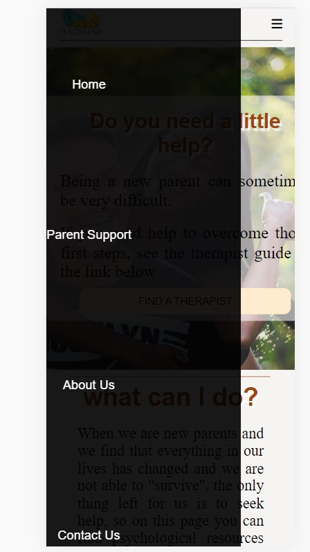

I used  a display block to put the menu items closer together and then change the display position from full screen to just a section below the menu bar, also I changed the colors to make look better

* ### one of the boxes in support page escapes from the screen in mobile version.

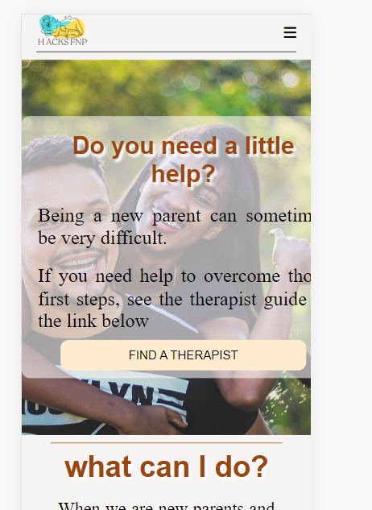

To fix this bug in the mobile version I have changed the width:400px to 90% in the media query 480px.

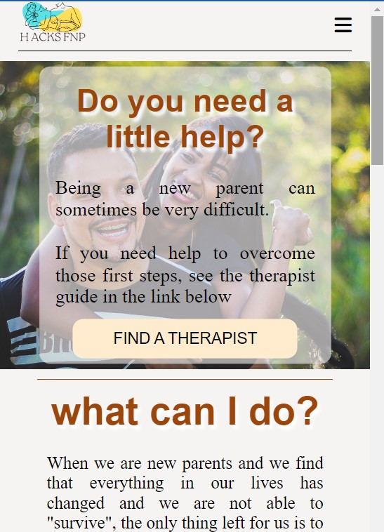

* The holderplace text in contact form is to small and it's hard to read.

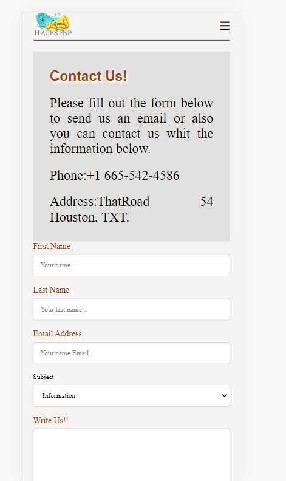

To fix this bug I commented in the Normalize.css document the line 164 that had a font-zise: 100% and font-family: inherit and in the style.css file I 
and I gave him a width:95% in a mobile version.

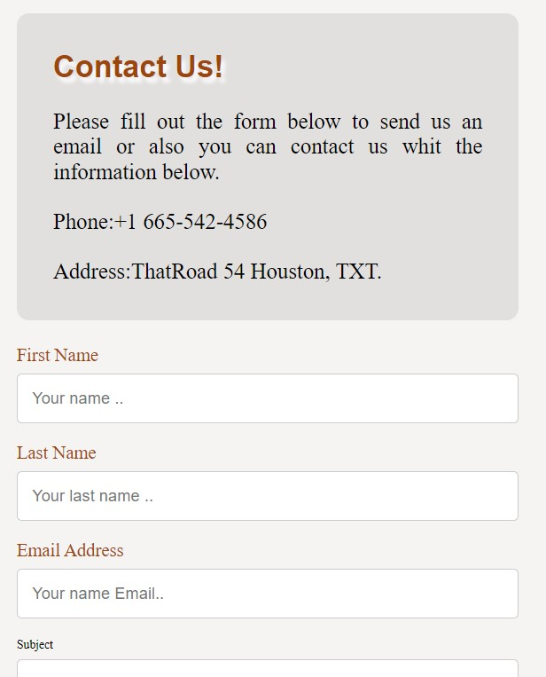

## Performance testing

I run [Lighthouse](https://developers.google.com/web/tools/lighthouse/) tool to check performance of the website.
I had to do couple of changes to improve performance. Screenshots are presented below:

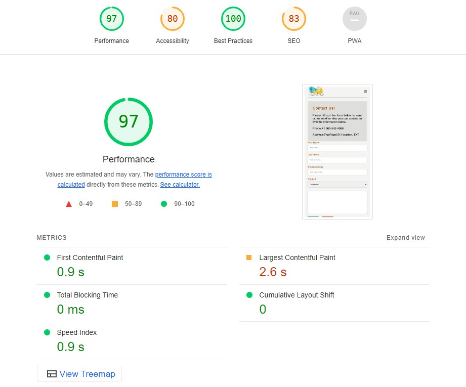
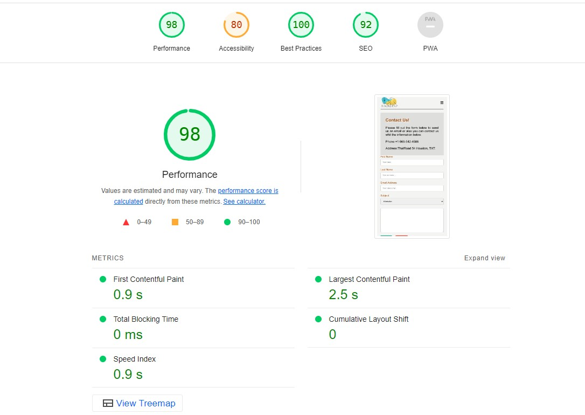

Final results:
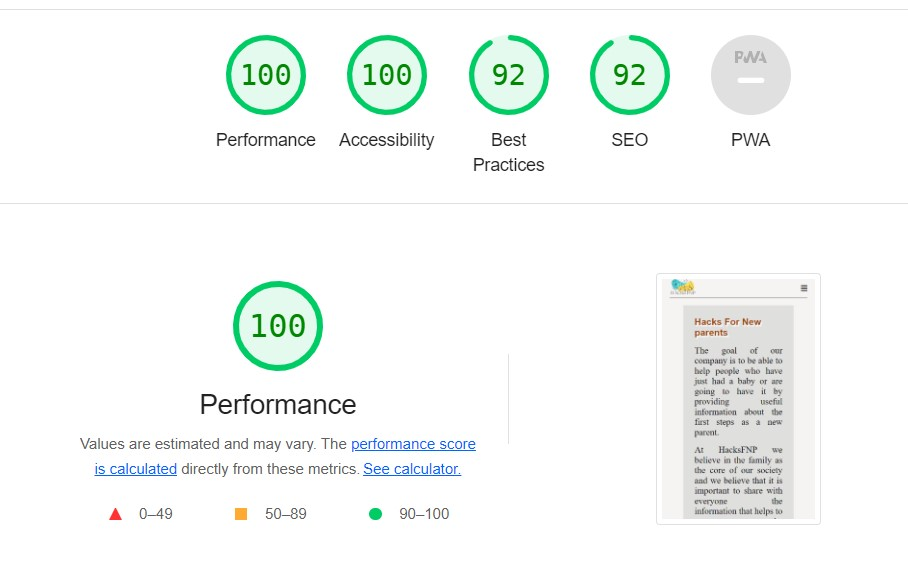
I noticed that this tests scores vary from time to time and depends on external libraries as well. 

## Code Validation
 At the and of the project I used two websites to validate a code
 
 * [W3C CSS Validator](https://jigsaw.w3.org/css-validator/) to validate CSS
 * [Nu Html Checker](https://validator.w3.org/) to test HTML

[Back to Table of contents](#table-of-contents)

___
# Deployment

The project was deployed on GitHub Pages. I used VsCode as a development environment where I commited all changes to git version control system.
I used push command in VsCode save changes into GitHub.

To deploy a project I had to:

* Log in to GitHub and click on repository to deploy ([PROJECT 1](https://github.com/richard9106/project-1))
* select `Settings` and find GitHub Pages section at the very bottom of the page
* from source select `none` and then `Milestone-Projects` branch.
* click `save` and page was deployed after auto-refresh.
>  Your site is published at https://richard9106.github.io/project-1/

To run localy:

### Firts method
* Log in to VScode account and link your repository to be open with VScode.
### Second method
* Creating a virtual space in gitHub https://github.com/richard9106/project-1 open the repository and then click on CODE green buttom and create a virtual space.
* once it has been created you can open it with VScode directly from your virtual space.

Alternatively you can [Clone](https://docs.github.com/en/free-pro-team@latest/github/creating-cloning-and-archiving-repositories/cloning-a-repository)
or [Fork](https://docs.github.com/en/free-pro-team@latest/github/getting-started-with-github/fork-a-repo)
this repository ([PROJECT 1](https://github.com/richard9106/project-1)) into your github account.

[Back to Table of contents](#table-of-contents)
___
# Credits

* To complete this project I used Code Institute student template: [gitpod full template](https://github.com/Code-Institute-Org/gitpod-full-template)

* Ideas and knowledge library:

    * [w3schools.com](https://www.w3schools.com)  I used code for navbar and style the contact form.

### Code

* Links transition: [CSS transition Property](https://www.w3schools.com/cssref/css3_pr_transition.asp)

### Images:

* link images page [Unsplash](https://unsplash.com/es/s/fotos/familia-con-bebe)

[Back to Table of contents](#table-of-contents)
___

# Screenshots

## Project screenshots

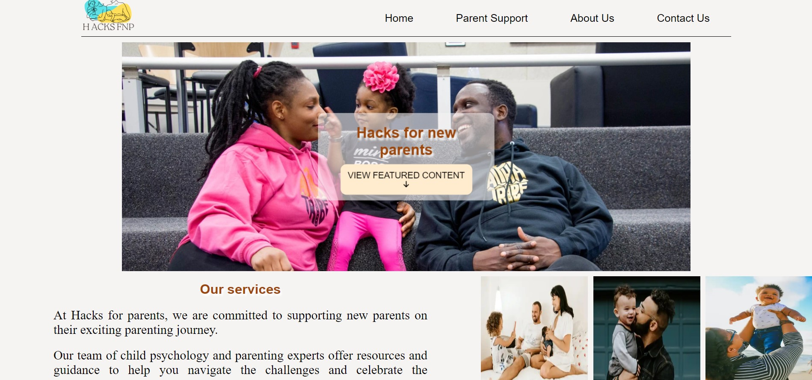

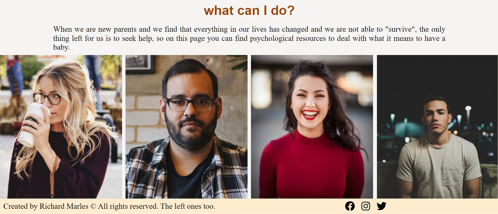

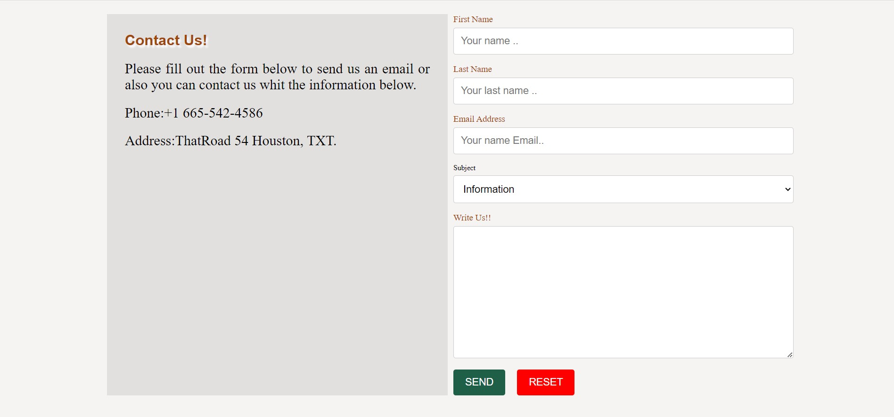

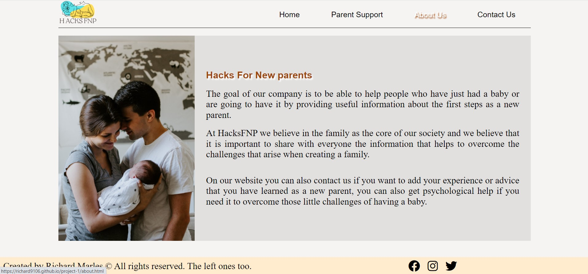

[Back to Table of contents](#table-of-contents)
___
